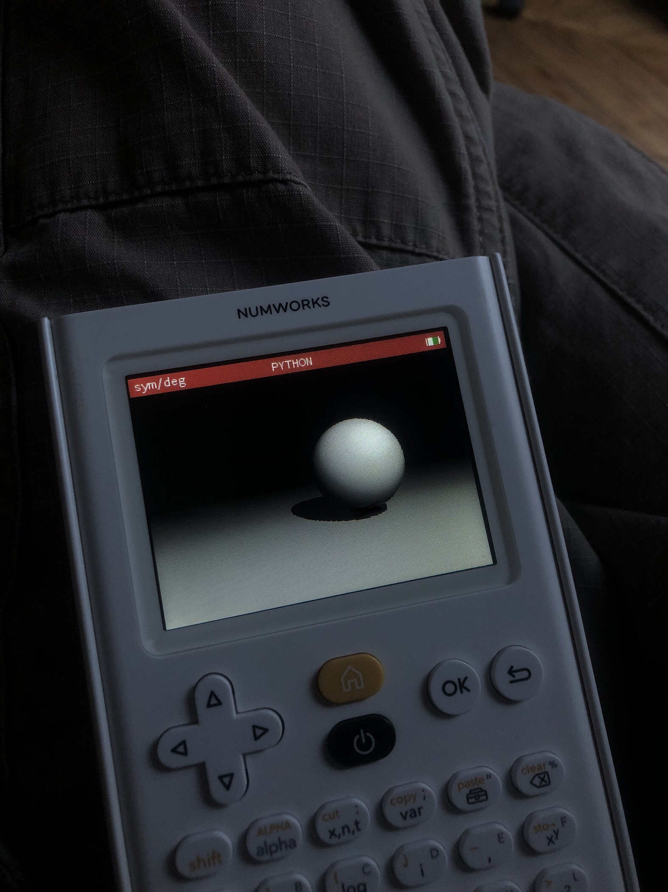

# Numworks 3Drender



Very inefficient way to render a 3D Scene on a numworks calculator, using Ray Marching.

I just rewrote [my GLSL scirpt](https://github.com/felop/NeuralRayMarching) in python to run in on my calculator. Fun to use dispite the extremely slow render speed per frame :
 - ~10 minutes
 - ~5 minutes (without the shadows)

<br><br><br><br><br><br><br><br><br><br>

### Examples of GLSL functions coded in python

```python
def length(o,p):
    return sqrt((o[0]-p[0])**2+(o[1]-p[1])**2+(o[2]-p[2])**2)

def product(list0,list2):
    facteurs = []
    for num0, num2 in zip(list0, list2):
        facteurs.append(num0 * num2)
    return facteurs
    
def normalize(v):
    root = sqrt(v[0]**2+v[1]**2+v[2]**2)
    v = [i/root for i in v]
    return v
```
